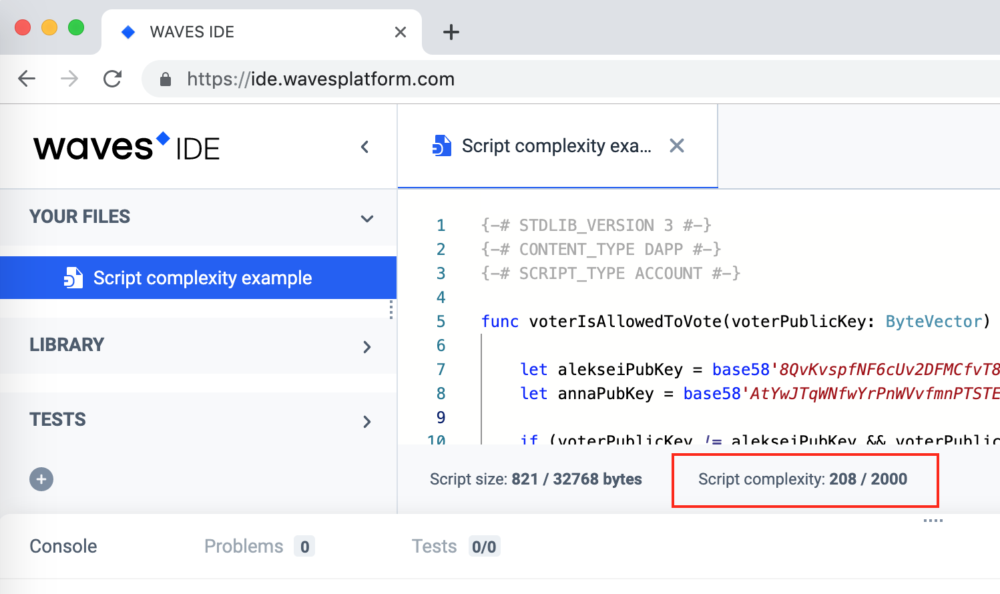

# RIDE script complexity

To estimate the computing resources that are required to execute a [RIDE script](/ride/ride-script.md), the term **script complexity** is used.

The complexity of a RIDE script is estimated based on complexities of all the [operators](/ride/operators.md) and [functions](/ride/functions.md) it consists of.

The complexity of a script can be seen in the [Waves IDE](https://ide.wavesplatform.com):

At the moment, the complexity of the script is limited to 2000.
