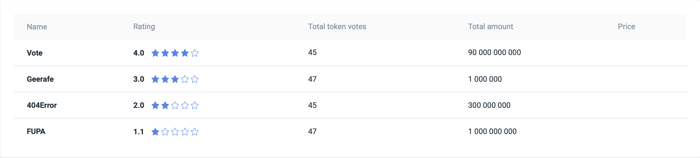
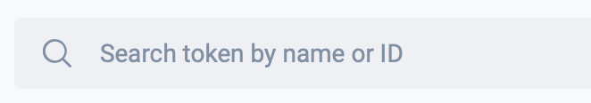
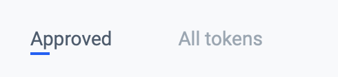
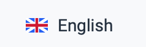
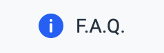
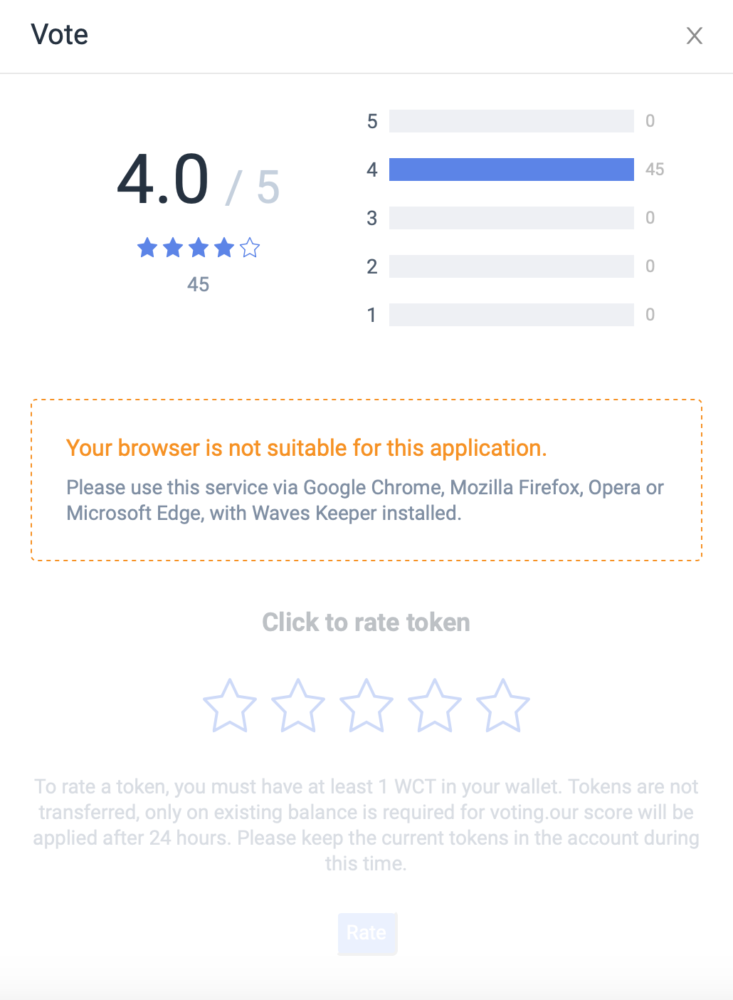
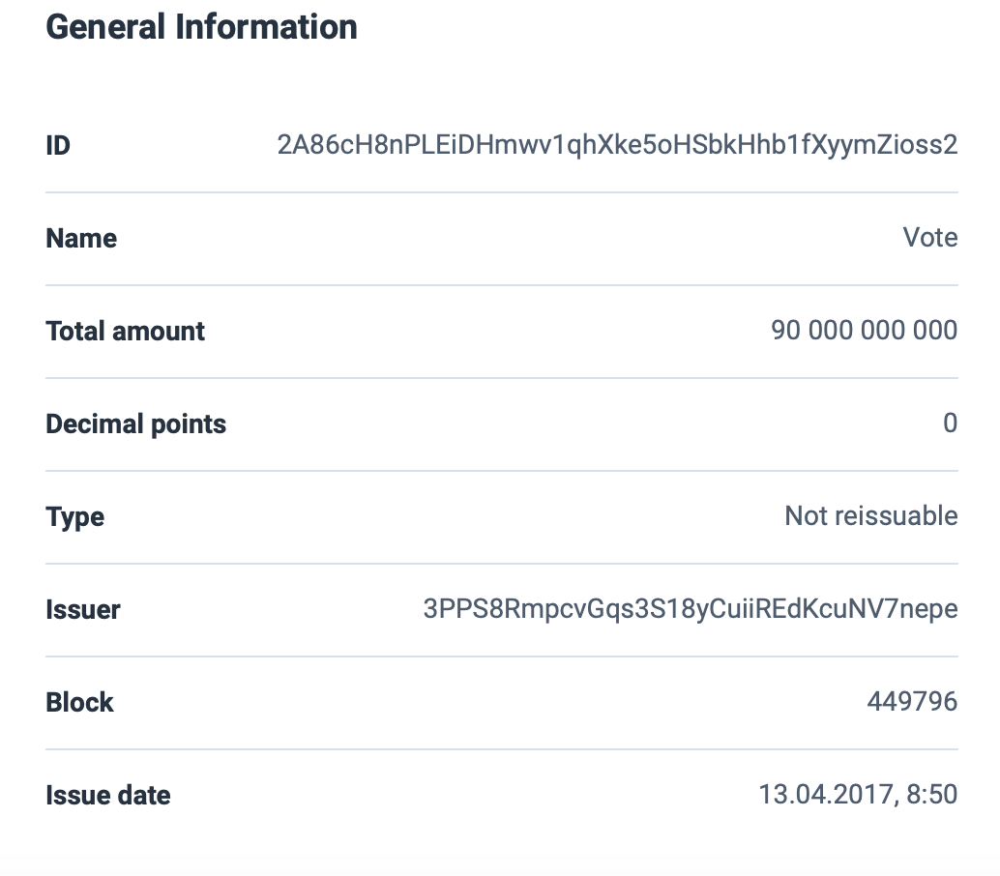

# About Waves Token Rating

[**Waves Token Rating **](https://tokenrating.wavesexplorer.com/)is a service that provides ratings for tokens \(projects\) issued on the Waves platform. Ratings are based on opinions of community members \(WCT token holders\) on a specific token.

## Main page

### Ratings table

The ratings table lists tokens that have already been rated.

| Column | **Description** |
| :--- | :--- |
| Name | Token name |
| Rating | The current token rating is from 1 to 5, rounded to one decimal place |
| Total token votes | The number of tokens voted \(sum of weight of scores\) |
| Total amount | Total number of tokens issued |
| Price | Current token price in USD from DEX. Updated every 3 hours. |

Tokens that have not yet been rated by anyone can be found using the search bar, either by name or by token ID.

A click on the rating row opens the token page.

### Search bar

Tokens that have not yet been rated by anyone can be found using the search bar, either by name or by token ID.

If the token already has a rating, then its current rating will be indicated next to it.

When you select a token, its page opens.

### Filters

If ‘All tokens’ is selected, then the table will display all tokens.

If ‘Approved’ is selected, then you will see only those tokens that have minimum rating and a certain number of total votes.  

### Localization

Switch Russian and English interface languages

### F.A.Q

This section contains some general information about the Waves Token Rating and a link to this description.

## Token page

The token page contains detailed information about the token and its rating. The title of the card is the name of the token.  

The top part of the token page displays the current token rating \(if any\) with details on the number of tokens who voted for each of the scores. Below are five stars with which the user can rate the token, the Rate button, which becomes active when the token is rated, and a hint.

Next is the **Market information **block \(if it's present\):

| Field name | Description |
| :--- | :--- |
| Price | Price from DEX |
| Cap | Multiplication of quantity and price |

Further goes the **General information **block:

| Field name | Description |
| :--- | :--- |
| ID | Token ID. |
| Name | Token name. |
| Total amount | A total number of tokens issued. |
| Decimal points | A number of symbols after the comma. |
| Type | Not reissuable or reissuable |
| Issuer | Sender address. |
| Block | The block in which the token release transaction fell \(height\). |
| Issue date | Token release date. |
| Description | Token description. |

## Restrictions 

Tokens can be rated from desktop browsers only; for mobile browsers, the service is available to read-only.

You can rate a token if Waves Keeper is installed in your browser, and you have at least 1 WCT in your balance.

WCT tokens are not transferred, only on existing balance is required for voting. Each vote is weighted according to the number of WCT in your balance.

## To rate a token 

To rate a token, select it in the ratings table or in the search bar, then on the token page click on 1 to 5 stars. Then, click the Rate button and sign the transaction using Waves Keeper - your vote will be applied after 24 hours.

You can rate a token from each address only once. If you have already rated the selected token, you will see your previous score on the token page. In this case, you can change your score if you rate this token again. Your previous score will be canceled, and the new one will be applied.

If no one has yet rated a token, then after you vote it will listed in the ratings table, but without a value, until the rating is calculated.

## Data Transaction of user score 

When the user has to rate a token, a date-transaction is formed with the following fields:

