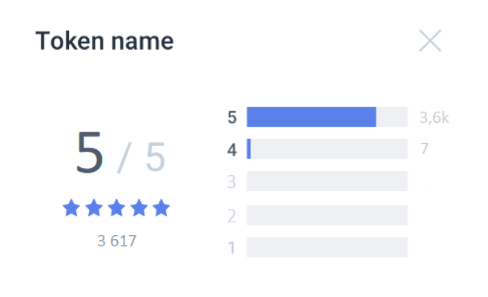

# About Waves Token Rating

**Waves Token Rating** is an online service (https://tokenrating.wavesexplorer.com) that shows the ratings of tokens (projects) issued on the Waves Platform.

Ratings of tokens are based on the opinions of community members. Only WCT token holders can participate in voting for tokens.

## Service user interface overview

See the page [Waves Token Rating user interface overview](/waves-token-rating/waves-token-rating-user-interface-overview.md).

## Restrictions

Tokens can be rated from desktop browsers only; for mobile browsers, the service is available to read-only.

You can rate a token if Waves Keeper is installed in your browser, and you have at least 1 WCT in your balance.

WCT tokens are not transferred, only on existing balance is required for voting. Each vote is weighted according to the number of WCT in your balance.

## To rate a token

To rate a token, select it in the ratings table or in the search bar, then on the token page click on 1 to 5 stars. Then, click the Rate button and sign the transaction using Waves Keeper - your vote will be applied after 24 hours.

You can rate a token from each address only once. If you have already rated the selected token, you will see your previous score on the token page. In this case, you can change your score if you rate this token again. Your previous score will be canceled, and the new one will be applied.

If no one has yet rated a token, then after you vote it will listed in the ratings table, but without a value, until the rating is calculated.

## Assessment and rating calculation 

### How is the user score formed? 

The score is discrete and can take values \[1, 2, 3, 4, 5\]. The number of WCT tokens on the balance sheet has a non-linear effect on the final assessment weight. The more tokens on the balance, the lower the coefficient.

Weight is calculated by the formula:

_**W = B¹ × k  **_\(1\), where

_**W**_– the total estimated weight of the score, rounded to the full value,

_**B¹**_– effective balance,

_**k**_– coefficient, which is calculated by the formula \(rounded to hundredths\):

_**B¹∈**\[1, 10\],**k = 1**_

_**B¹ ∈ \(**10, 150 000\], **k = – 0,091 × ln\(B¹\) + 1,20958**_

_**B¹ ∈**\(150 000, 540 000\], **k = \(– 0,00019 × B¹ + 153\) ÷ 1000**_

_**B¹ ∈**\(540 000, ∞\)**, k = 0,05**_

Calculation of the effective balance:

The current balance is recorded at the time of voting _**B **WCT. Within 24 hours, all WCT **spending **operations are checked at this address and their volume is summarized. After 24 hours, the amount of WCT token transactions \(if any\) outgoing within 24 hours is subtracted from _**B**_. The result is an effective balance. _**B¹. **If its value is&gt; 0, apply formula \(1\) to calculate the total weight.

The resulting value \(score and weight\) is recorded in the blockchain as the final score from the user. If the value is &lt;0, the score is not counted.

## Rating calculation 

The current rating is an instantaneous weighted average of user scores.

### Example 
User1 rated the token at 5 stars. At the time of voting on his account 10,000 WCT.

There were 3 operations on his accounts in 24 hours: spending 300 WTC, spending 200 WTC and income 500 WTC. Therefore, total spending transactions amount to 300 + 200 = 500. 9500 - is an effective balance **B¹ **for the calculation, despite the fact that the same 10,000 WCT remained on the account after 24 hours as at the time of the assessment.

_**B¹ **is in the interval \(10, 150 000\], it means that we calculate _**k **by the formula:

_**k = – 0,091 × ln\(B¹\) + 1,20958**_=-0.091 \* ln\(9500\) + 1.20958 = 0,38

_**W = B¹ × k**_= 0,38 \* 9500 = 3610

Total: the token will receive a rating of 5 with a weight of 3610 from_User1_.

Another\_User2\_rated the same token at 4 stars. At the time of voting on his account 7 WCT.

There were no account transactions for 24 hours, so the effective balance is 7 WCT.

_B¹  \_is in between \[1, 10\], in this case _**k = 1**

_**W = B¹ × k**_= 7 \* 1 = 7

Total: the token will receive a rating of 4 with a weight of 7 from _User2._

The **token rating **will be the weighted average of the scores: Rating = \(5\*3610 + 4\*7\) / 3617 = 4.998 \(rounded up to 5.0\)

The total tokens votes will be: for 5 - 3.6k, for 4 - 7.

