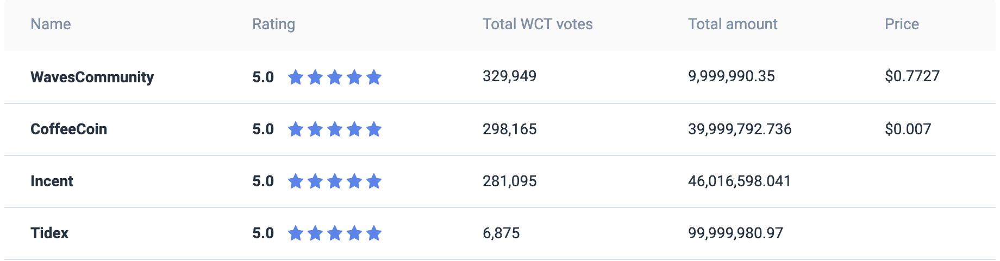
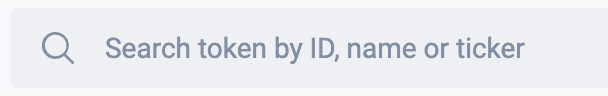
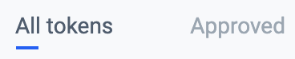
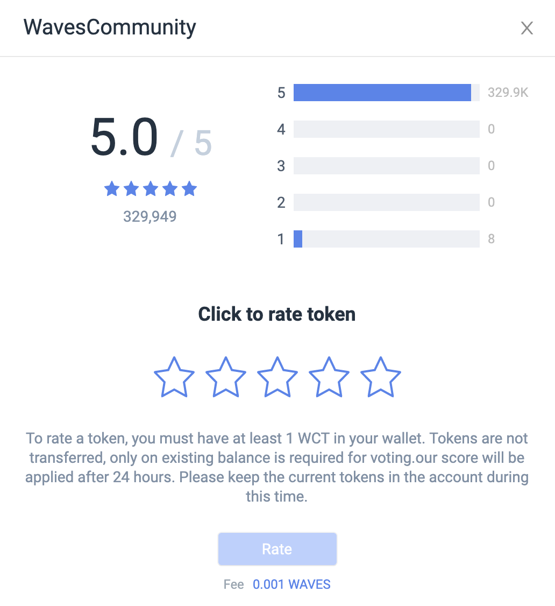
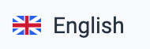

# Waves Token Rating user interface overview

## Rating table

The rating table contains information about tokens that someone has already rated.

Description of the rating table:

|Column|Description|
|---|---|
|Name|The token name|
|Rating|The current token rating (from 1 to 5, rounded to one decimal place)|
|Total WCT votes|The sum of the [effective balances](/waves-token-rating/about-waves-token-rating.md) of all addresses who voted for the token. The sum is specified in WCT|
|Total amount|The total amount of issued tokens|
|Price|The current price of one token taken from DEX (the price value is updated every three hours)|

When you click on the token line in the table, the token card opens.

Tokens, which no one has yet rated, can be found using the search box.

## Token Search String

The search string allows you to search for tokens by name, ticker or token ID.

If the token already has a rating, then its current rating will be displayed next to it.

When you select a token, its card opens.

## Filters

**All tokens** displays tokens for which someone has voted.

**Approved** displays tokens that have a rating and the sum of the [effective balances](/waves-token-rating/about-waves-token-rating.md) of all the addresses that voted for them is greater than a certain number.

## Token card

In the title of the card, the name of the token is displayed.

The top of the card contains detailed information about the token and its rating (if any).

Below are five stars with which the user can rate the token, as well as the **Rate** button, which becomes active when the token is rated.

Next goes the **Market Information** block (if the token is traded on DEX, otherwise the section will not be displayed):

|Field|Description|
|---|---|
|Price|The current price from DEX|
|Cap|The capitalisation (the product of the token's price and the number of the issued tokens)|

Further goes the **General Information** block:

|Field|	Description|
|---|---|
|ID	|The token identifier|
|Name	|The token name|
|Total amount|The total number of issued tokens|
|Decimal points|The number of digits after the comma. Specifies the minimum quantity of tokens that one can operate with during the transaction|
|Type	|Determines whether it will be possible to issue additional tokens in the future. It can be one of the two values: "Reissuable" or "Not reissuable"|
|Issuer	|The address of the account the token was issued from|
|Block	|The height of the blockchain at which the token issue transaction was included into the block|
|Issue date	|The token issue date|
|Description	|The token description|

## Language selection

Allows you to select the language of the interface (English or Russian).

## F.A.Q.

Contains answers to frequently asked questions about the Waves Token Rating.

