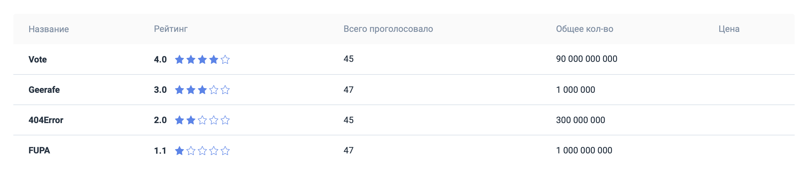
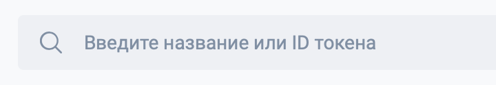
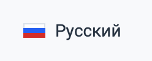
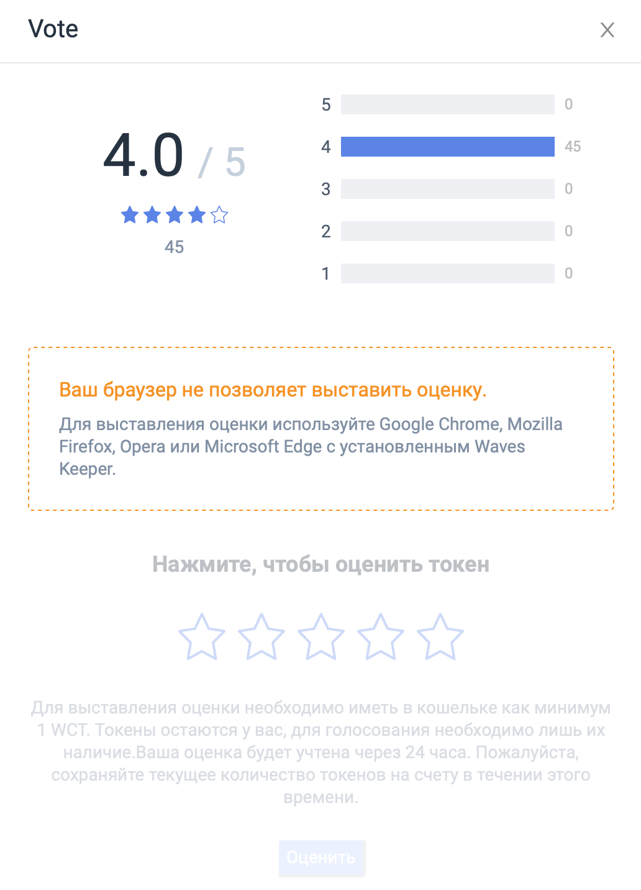

# О Waves Token Rating

Waves Token Rating — онлайн-сервис \([https://tokenrating.wavesexplorer.com](https://tokenrating.wavesexplorer.com)\), показывающий рейтинги токенов \(проектов\), выпущенных на платформе Waves.  
Рейтинги токенов формируются на основе мнений участников сообщества \(держателей токена WCT\) об этом токене.



| Столбец | **Описание** |
| :--- | :--- |
| Всего проголосовало | Количество проголосовавших WCT токенов. |
| Название | Название токена. |
| Общее количество | Общее количество выпущенных токенов. |
| Рейтинг | Текущий рейтинг токена \(от 1 до 5, с округлением до одного знака после запятой\). |
| Цена | Текущая цена из DEX \(обновляется один раз в три часа\). |

Токены, которым ещё никто не выставил оценку, можно найти при помощи поисковой строки, указав название или ID токена.

При нажатии на строку токена в таблице, открывается карточка токена.

### Поиск токена

Поисковая строка позволяет искать токены по названию или по ID.

Если токен уже имеет рейтинг, то рядом с ним будет указываться его текущий рейтинг.

При выборе токена открывается его карточка.



### Фильтры

**Одобренные**— показывает токены с определенным порогом рейтинга и количество оценивающих токенов.

**Все токены**— показывает все токены, которые имеют рейтинг в сервисе.


### Выбор языка

Позволяет выбрать язык интерфейса \(русский или английский\).



### F.A.Q.

Содержит ответы на часто задаваемые вопросы по Waves Token Rating.


## Карточка токена

Карточка токена содержит подробную информацию о токене и о его рейтинге. В заголовоке карточки отображается название токена.



В верхней части карточки отображаетсятекущий рейтинг токена \(если он есть\) с детализацией по количеству токенов,голосовавших за каждую из оценок.

Ниже расположены пять звезд, при помощи которых пользователь может оценить токен, а также кнопка**Оценить**, которая становится активна, когда токену выставлена оценка, и подсказка.

Далее расположен блок**Рыночная информация**\(если есть\):

| Поле | Описание |
| :--- | :--- |
| Цена | Текущая цена из DEX. |
| Капитализация | Произведение цены и количества выпущенных токенов. |

Далее идет блок **Основная информация**:

| поле | Описание |
| :--- | :--- |
| ID | Идентификатор токена. |
| Блок | Высота блока, на которой транзакция выпуска токена попала в блок. |
| Всего выпущено | Количество выпущенных токенов. |
| Дата выпуска | Дата выпуска токена. |
| Знаков после запятой | Количество знаков после запятой. Определяет минимальное количество токена, которым можно оперировать \(переводить\). |
| Название | Название токена. |
| Описание | Описание токена. |
| Тип | Определяет можно ли будет производить довыпуск токенов в будущем. Может принимать два значения: "перевыпускаемый" или "не перевыпускаемый". |
| Эмитент | Адрес аккаунта, с которого был выпущен токен. |

## Ограничения

Оценивать токены можно только из настольных версий браузеров. Для мобильных версий браузеров сервис доступен только на просмотр.

Процесс голосования за любой токен может быть инициирован любым пользователем при условии, что в его браузере установлен Waves Keeper, и на балансе есть как минимум 1 WCT. Токены WCT не списываются при оценке \(количество токенов на момент голосования влияет на вес оценки\).

## Выставление оценки

Чтобы выставить оценку токену пользователь должен выбрать его в таблице рейтинга или через поисковую строку, затем на карточке токена указать количество звезд от 1 до 5, нажать кнопку "Оценить" и подписать транзакцию.

Если пользователь ранее уже голосовал за выбранный токен, то на карточке токена он увидит свою предыдущую оценку. В этом случае пользователь может изменить ее, проголосовав повторно. Предыдущая оценка будет аннулирована, а новая — учтена.

Если токен ещё никто не оценивал, то после выставления оценки он появится в таблице рейтинга, но без рейтинга, до того момента, пока оценка пользователя не будет рассчитана.

## Транзакция данных оценки

Когда пользователь выставил токену оценку, то формируется транзакция данных со следующими атрибутами:

Пример содержимого массива data транзакции данных с оценкой пользователя:

| Название ключа атрибута | Тип данных ключа | Наличие атрибута обязательно | Описание |
| :--- | :--- | :--- | :--- |
| tokenRating | строка | + | Служебное поле, позволяющее находить транзакции с оценкой токенов в Wave Token Rating. |
| assetId | строка | + | Идентификатор токена. |
| score | целое число | + | Оценка, которую выставил пользователь. |

Пример содержимого массива data транзакции данных с оценкой пользователя:

```js
{
    "key": "tokenRating",
    "type": "string",
    "value": "tokenRating"
}, {
    "key": "assetId",
    "type": "string",
    "value": "BrjUWjndUanm5VsJkbUip8VRYy6LWJePtxya3FNv4TQa"
}, {
    "key": "score",
    "type": "integer",
    "value": 4
```

## Расчет веса оценки токена, выставляемой пользователем

Оценка может принимать целые значения от 1 до 5 — \[1, 2, 3, 4, 5\].

Количество токенов WCT на балансе оценивающего влияет на коэффициент`k`_нелинейно:_ чем больше токенов на балансе, тем меньше`k`.

Вес оценки`W`рассчитывается по формуле:

_**W = B × k  **_\(1\),

где

_**B**_ — эффективный баланс,

_**k**_—коэффициент, который рассчитывается по формуле\(округляется до сотых\):

`W` при расчетеокругляется до целой величины,

_**B ∈**\[1, 10\],**k = 1**_

_**B ∈ \(**10, 150 000\],**k = – 0,091 × ln\(B\) + 1,20958**_

_**B ∈**\(150 000, 540 000\],**k = \(– 0,00019 × B + 153\) ÷ 1000**_

_**B ∈**\(540 000, ∞\)**, k = 0,05**_

Эффективный баланс рассчитывается следующим образом:

В момент голосования записывается значение текущего баланса_**B**\_WCT. В течении 24 часов проверяются все**расходные**операции WCT по данному адресу и суммируется их объем. По истечении 24-х часов из_**B**_вычитается сумма исходящих за 24 часа транзакций токена WCT \(если были\). В результате получается эффективный баланс_**B.**\_ Если его значение &gt; 0, применяем формулу \(1\) для расчета итогового веса.

Полученное значение \(оценка и вес\) записываются в блокчейн как финальная оценка от пользователя. Если значение &lt;0, оценка не засчитывается.

## Расчет рейтинга токена

Текущий рейтинг представляет собой мгновенное средневзвешенное значение оценок, выставленных пользователями.

## Пример от выставления оценки до расчета рейтинга

_Пользователь1 _оценил токен в 5 баллов. На момент голосования на его счету 10000 WCT.

За 24 часа на его счету было 3 операции: расход 300 WTC, расход 200 WTC и доход 500 WTC. Получается, расходные операции составляют 300 + 200 = 500. Т.е. 9500 - это эффективный баланс _**B **_для расчета, несмотря на то, что на счету через 24 часа остались те же 10000 WCT, что и на момент выставления оценки.

_**B **_находится в промежутке_\(10, 150 000\],_значит рассчитываем _**k **_по формуле:

_**k = – 0,091 × ln\(B\) + 1,20958**_=-0.091 \* ln\(9500\) + 1.20958 = 0,38

_**W = B × k**_= 0,38 \* 9500 = 3610

Итого: токен получит оценку 5 с весом 3610.

Другой _Пользователь2 _оценил тот же токен в 4 балла. На момент голосования на его счету 7 WCT.

За 24 часа расходных операций по счету не было, значит эффективный баланс равен 7 WCT.

_**B **_находится в промежутке_\[1, 10\], _в этом случае_**k = 1**_

_**W = B × k**_= 7 \* 1 = 7

**Итого: **токен получит оценку 4 с весом 7.

**Рейтинг токена **будет являться средевзвешенным оценок: Rating = \(5\*3610 + 4\*7\) / 3617 = 4.998 \(округляется до 5.0\)

Общее количество голосовавших токенов будет: за 5 - 3.6k, за 4 - 7.


## Оракул Token Rating {#id-ОWavesTokenRating-ОракулTokenRating}

Token Rating Oracle ежедневно публикует в Waves блокчейн транзакцию данных с рейтингом токенов, у которых он изменился за прошедшие 24 часа. В одну транзакцию входит не более 100 изменений, поэтому, если их больше, то публикуется несколько транзакций.

Карточка оракула Token Rating в Waves Oracles: [https://oracles.wavesexplorer.com/oracle/GgR4urzrig9p8VxHkUmnpZRfxLbzb9xFHUEABnZqF6tG](https://oracles.wavesexplorer.com/oracle/GgR4urzrig9p8VxHkUmnpZRfxLbzb9xFHUEABnZqF6tG)

Транзакция данных оракула Token Rating состоит из массива “склеенных” ключей:

| Key  | Type | Required | Description |
| :--- | :--- | :--- | :--- |
| assetRating\_assetId  | string |  | Рейтинг токена с assetId. assetId необходимо заменить на реальный идентификатор ассета \(см. пример ниже\) |


Пример содержимого массива data транзакции данных оракула Token Rating:

```js
{
    "key": "assetRating_62LyMjcr2DtiyF5yVXFhoQ2q414VPPJXjsNYp72SuDCH",
    "type": "string",
    "value": "4.5"
}, {
    "key": "assetRating_4QUMfcxQB112bZdyoAPrp1oTVN4cBA68NpGkD7W3n33i",
    "type": "string",
    "value": "3.9"
}
...
```


