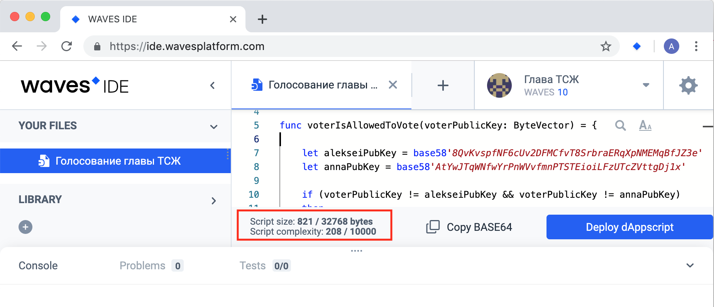

# Простое голосования на блокчейне Waves

Глава ТСЖ (товарищества собственников жилья) задает вопрос жильцам дома: "Уважаемые жильцы, согласны ли вы со строительством детской площадки во дворе вашего дома?".

На блокчейне Waves необходимо реализовать голосование жильцов дома за строительство детской площадки.

## План действий

1. Создадим аккаунт главы ТСЖ.
2. Создадим аккаунты жильцов дома.
3. Создадим dApp-скрипт с методом vote.
4. Привяжем dApp-скрипт к аккаунту главы ТСЖ, создав таким образом dApp.
5. Проголосуем с аккаунтов жильцов дома, вызвав метод vote dApp.
6. Узнаем результаты голосования.

## 1. Создание аккаунта главы ТСЖ

Зайдем в настройки Waves IDE.


Убедимся, что выбрана тестовая сеть.


Создадим аккаунт главы ТСЖ. Для этого выберем Generate new account.


Переименуем созданный аккаунт в "Глава ТСЖ".


Скопируем адрес из карточки аккаунта главы ТСЖ и с помощью Faucet пополним его баланс на 10 WAVES. Токены понадобятся главе ТСЖ для оплаты комиссии за транзакцию установки скрипта, когда он будет привязывать dApp-скрипт к своему аккаунту.


## 2. Создание аккаунтов жильцов дома
Аналогично создадим аккаунты жильцов дома Алексея и Анны и пополним их балансы на 10 WAVES. Токены им понадобятся для оплаты комиссии за транзакцию вызова скрипта, когда они будут голосовать, вызывая метод vote dApp.


## 3. Создание dApp-скрипта

Создадим dApp-скрипт, выбрав в выпадающем меню **DApp**.


Переименуем скрипт в "Голосование главы ТСЖ".


Заменим автоматически сгенерированный код на следующий:

```
{-# STDLIB_VERSION 3 #-}
{-# CONTENT_TYPE DAPP #-}
{-# SCRIPT_TYPE ACCOUNT #-}
 
func voterIsAllowedToVote(voterPublicKey: ByteVector) = {
 
    let alekseiPubKey = base58'8QvKvspfNF6cUv2DFMCfvT8SrbraERqXpNMEMqBfJZ3e'
    let annaPubKey = base58'AtYwJTqWNfwYrPnWVvfmnPTSTEioiLFzUTcZVttgDj1x'
 
    if (voterPublicKey != alekseiPubKey && voterPublicKey != annaPubKey)
    then
        false
    else
        true
 
}
 
@Callable(i)
func vote(theVote: Int) = {
     
    if(!voterIsAllowedToVote(i.callerPublicKey))
    then
        throw("Вы не можете голосовать, так как вас нет в списке голосующих!")
    else
        let dataFromStorage = this.getInteger(i.callerPublicKey.toBase58String())
 
        if(dataFromStorage.isDefined())
        then
            throw("Вы уже голосовали! Повтороное голосование запрещено.")
        else
            WriteSet([DataEntry(i.callerPublicKey.toBase58String(), theVote)])
 
}
```

### Пояснения к коду dApp-скрипта

#### Функция vote

Функция `vote` возвращает структуру `WriteSet`, внутри которой происходит запись голосов в хранилища данных аккаунта главы ТСЖ.

Перед функцией vote указан атрибут `Callable`, который делает данную функцию вызываемой у dApp. У данного атрибута `i` — переменная, содержащая информацию о транзакции, в рамках которой был вызван скрипт. Мы используем переменную `i` в коде для получения публичного ключа аккаунта `i.callerPublicKey`, вызвавшего наш скрипт.

Для простоты, в функции vote нет никаких проверок значения переменной `theVote`.

#### Функция voterIsAllowedToVote

Функция `voterIsAllowedToVote` проверяет, что аккаунт, вызывающий скрипт, имеет право голосовать. Значения публичных ключей в коде `alekseiPubKey` и `annaPubKey` возьмем из карточек аккаунтов Алексея и Анны.


Мы жестко прописали значения публичных ключей в коде нашего скрипта. В реальном примере мы могли бы считывать ключи, например, из хранилища данных аккаунта главы ТСЖ (предварительно записав их туда).

#### Функция getInteger

Функция `getInteger` получает значения из хранилища данных аккаунта по ключу:

```
let dataFromStorage = this.getInteger(i.callerPublicKey.toBase58String())
```

В интерфейсе Waves IDE можно видеть размер скрипта и его сложность.



## 4. Привязка dApp-скрипта к аккаунту главы ТСЖ

Нажмем на кнопку **Deploy dAppscript**.


В открывшемся окне в комбинированном списке **Account** выберем значение "Глава ТСЖ". Подпишем транзакцию, нажав **Add sign**.


Заметим, что подписать транзакцию можно также секретной фразой или с помощью Waves Keeper.


Отправим с аккаунта главы ТСЖ транзакцию установки скрипта, нажав **Publish**. Вверху экрана появится плашка с текстом о том, что транзакция была успешно отправлена.


Таким образом, мы только что создали dApp.

В Waves Explorer, _в тестовой сети_, найдем информацию об активности на адресе главы ТСЖ. Для этого ведем адрес главы ТСЖ в строку поиска и нажмем **Enter**.


По адресу главы ТСЖ отображаются две транзакции: пополнение баланса на 10 WAVES и отправка транзакции установки скрипта. Заметим, что с баланса аккаунта главы ТСЖ списали комиссию за транзакцию установки скрипта в 0.001 WAVES.


## 5. Голосование

Для того, чтобы проголосовать, жильцу необходимо отправить транзакцию вызова скрипта со своего аккаунта. В транзакции необходимо указать адрес dApp, имя вызываемого метода dApp, а также передаваемые в метод параметры.

Отправим транзакцию вызова скрипта с аккаунта Алексея с помощью REPL. Для этого в Waves IDE _выберем аккаунт Алексея_.


Далее в REPL выполним следующую команду:

```
broadcast(invokeScript({dApp: "3Mz2X8c4Gpf8uporPrkEHA5TH73pYDYg6vL", call: {function: "vote", args: [{type: "integer", value: 7}]} }))
```

Если все прошло успешно, то мы увидим следующий результат (развернув объект `Promise` в консоли):


Аналогично проголосуем с аккаунта Анны, предварительно выбрав аккаунт Анны:

```
broadcast(invokeScript({dApp: "3Mz2X8c4Gpf8uporPrkEHA5TH73pYDYg6vL", call: {function: "vote", args: [{type: "integer", value: 25}]} }))
```

Если мы попробуем повторно проголосовать с аккаунта Алексея или Анны, то мы увидим ошибку:


Если мы попробуем проголосовать с аккаунта главы ТСЖ, то мы увидим ошибку:


## 6. Просмотр результатов голосования

На вкладке `Data` в Waves Explorer просмотрим содержимое хранилища данных аккаунта главы ТСЖ.


На скриншоте видно, что в хранилище данных аккаунта главы ТСЖ записаны две пары ключ-значение.