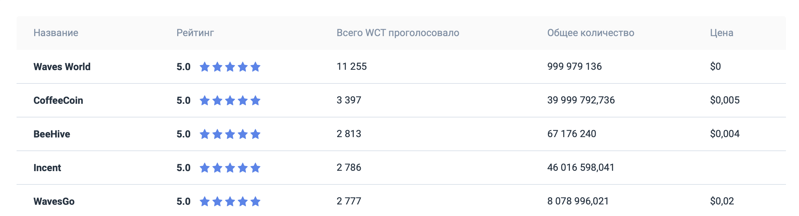
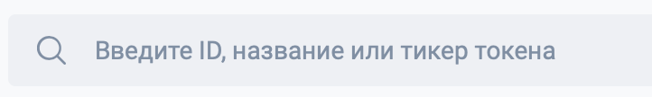
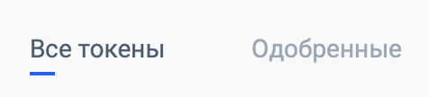
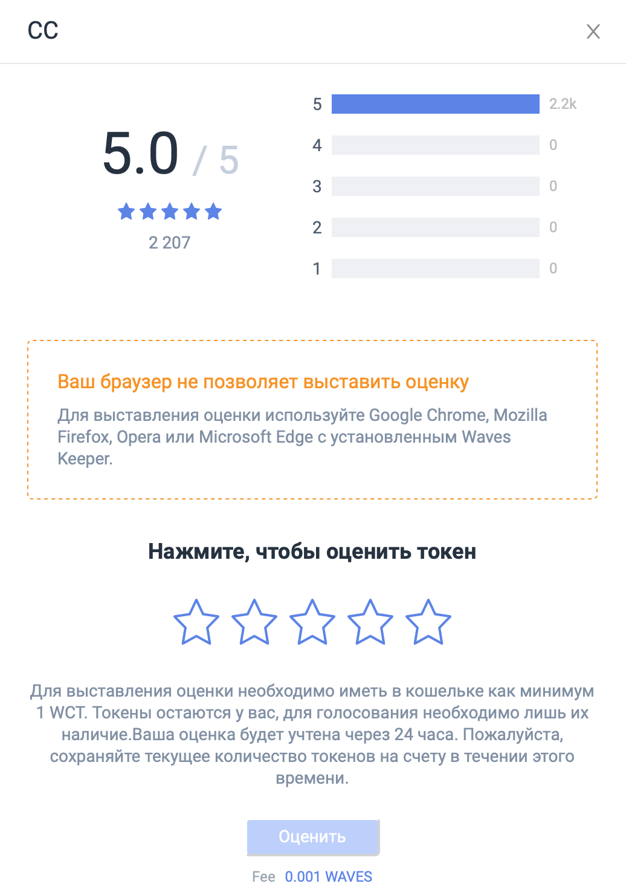
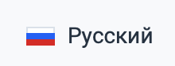
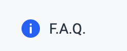

# Обзор пользовательского интерфейса Waves Token Rating

## Таблица рейтингов

Таблица рейтингов содержит информацию о токенах, которым кто-то уже выставил оценку.

Описание таблицы рейтингов:

|Столбец|Описание|
|---|---|
|Название|Название токена|
|Рейтинг|Текущий рейтинг токена (от 1 до 5, с округлением до одного знака после запятой)|
|Всего WCT проголосовало|Сумма [эффективных балансов](/waves-token-rating/about-waves-token-rating.md) всех проголосовавших за токен адресов. Сумма указана в WCT|
|Общее количество|Общее количество выпущенных токенов|
|Цена|Текущая стоимость одного токена, взятая из DEX (значение обновляется один раз в три часа)|

При нажатии на строку токена в таблице, открывается карточка токена.

Токены, которым ещё никто не выставил оценку, можно найти при помощи поисковой строки.

## Строка поиска токенов

Поисковая строка позволяет искать токены по названию, тикеру или ID токена.

Если токен уже имеет рейтинг, то рядом с ним будет указываться его текущий рейтинг.

При выборе токена открывается его карточка.

## Фильтры

**Все токены** — отображаются токены, за которые кто-либо проголосовал.

**Одобренные** — отображаются токены, у которых рейтинг и сумма [эффективных балансов](/waves-token-rating/about-waves-token-rating.md) всех проголосовавших за них адресов больше определенного значения.

## Карточка токена

В заголовке карточки отображается название токена.

В верхней части карточки содержится подробная информация о токене и о его рейтинге (если он есть). 

Ниже расположены пять звезд, при помощи которых пользователь может оценить токен, а также кнопка **Оценить**, которая становится активна, когда токену выставлена оценка.

Далее расположен блок **Рыночная информация** (если токен торгуется на DEX, иначе раздел не будет отображаться):

|Поле|Описание|
|---|---|
|Цена|Текущая цена из DEX|
|Капитализация|Произведение цены на количество выпущенных токенов|

Ниже идет блок **Основная информация**:

|Поле|	Описание|
|---|---|
|ID	|Идентификатор токена|
|Название	|Название токена|
|Всего выпущено|	Количество выпущенных токенов|
|Знаков после запятой|	Количество знаков после запятой. Определяет минимальное количество токена, которым можно оперировать при переводе|
|Тип	|Определяет, можно ли будет производить довыпуск токенов в будущем. Может принимать два значения: "перевыпускаемый" и "не перевыпускаемый"|
|Эмитент	|Адрес аккаунта, с которого был выпущен токен|
|Блок	|Высота блокчейна, на которой транзакция выпуска токена попала в блок|
|Дата выпуска	|Дата выпуска токена|
|Описание	|Описание токена|

## Выбор языка

Позволяет выбрать язык интерфейса (русский или английский).

## F.A.Q.

Содержит ответы на часто задаваемые вопросы по Waves Token Rating.

